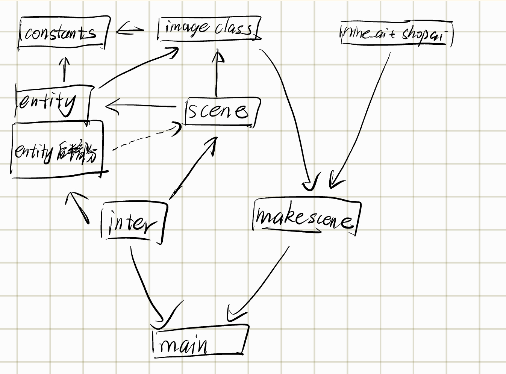

# 代码

## 前转

首先我们考虑的是做xy坐标还是xz坐标(一个方向为垂直方向)，并写了`/demo/test.py`和`/demo/test-xz.py`发现xz方案的跳跃的手感（大跳和小跳），爬墙，重力系统等还是比较麻烦的，考虑到之后还会扩展许多东西，遂放弃。不过读者可以跑一下体验，支持跳跃和爬墙跳。

然后经过商议打算做泡泡堂。

首先是人物行动的是否只能在整数格上的问题。我们发现`/demo/test.py`人物在走入障碍围成的胡同（狭窄通道）时由于胡同的宽度和人物碰撞箱大小过于接近，难以对准，这当然可以通过缩小碰撞箱解决（但这样人物可以在胡同内侧向移动，但倒也没什么大不了的），不过我们当时决定人物只能在格子中央（相当在棋盘的黑白格子上）

考虑到人物只能在格子里走动，最开始的方案是大小帧方案（一个相当愚蠢的方案）：每个若干帧处理逻辑（大帧），其余帧只做渲染（小帧），人物在每两个大帧间移动一格，小帧来保证人物的移动是连续的。但是等笔者写完`/demo/demo.py`时才意识到一个严重的问题：人物不跟手。

`--|---(press)---|------------|---`$\tiny\text{竖线表示大帧}$

按下键盘的过程是在两个大帧之间完成的（如上图），那应该在第二个竖线处完成移动呢还是第三个呢？都不合适，一个会让运动不匀速一个会带来巨大延迟，取平衡的话会兼有两个缺点。读者可以自行尝试这垃圾的手感。

大小帧是行不通的。

不过这个方案的其他部分在最终的代码中得到了沿用，如存地图方式根据这个方案改成了二维数组套字典的方式，没有事件队列的entity-map架构（瞎起的名字，勿在意）

## 核心代码架构与设计概述

### entity-map架构

场地上所有能动的物品都为实体(entity)，所有不能动的物品作为格子存储在地图的二维数组中。

实体和实体之间不会直接发信息，而是通过地图类（`Mapper`）发信息。（某种意义上地图相当于起了部分事件队列的功能）这样函数调用在`entity`和`Mapper` 间回转（有点像二分图欸），一定程度上减少出现无限递归的概率。

- 比如说，实体完成自身的初始化之后调用构造函数(`__init__`)里的`initInMap`参数，在对应的地图类上进行初始化（如存到二维数组套字典中等）

然后原则上每个实体只修改自己的数据，不修改别的实体的数据，最好也不随便改地图的数据（有一部分没遵守，毕竟py好像没有 const 关键字，写着写着就忘了），如果想修改其他实体的数据，则尽量通过地图类调用其他实体的成员函数修改。这样做的目的是避免数据的混乱，不过在这个项目中好像也没有感觉出便利。

在每一帧中，依次调用`keyboard` `clock` `draw`事件。

- keyboard : 为catchKeyboard函数，将键盘输入按照当前玩家的状态分配到 `me.keyboard` 或 `dialoger.keyboard` ，它们根据键盘输入的信息进行预移动，切换对话上下文等。

- clock : 为 `me.clock`和`thisMap.clock`(其中在`thisMap.clock`又会调用地图中所有实体的clock成员函数)，它们将游戏推动到下一游戏时刻：进行entity的移动，炸弹爆炸等的计时，计时到0之后的处理等：大部分逻辑的处理都在这个阶段进行。(`dialog`类不需要clock，因为它按回车更新)

- draw ： 为`thisMap.draw`和`dialogger.draw`。它们渲染。`thisMap.draw`按照`camera`（镜头移动偏移量）等按照顺序从二维数组表示的图格中从左到右从上到下渲染（以便处理图片堆叠顺序）；`dialogger.draw` 绘制对话框。

**为啥不用事件队列？**

TODO

### 二维数组套字典的存图方式

由于所有实体实际上只能在格子里，无须复杂的碰撞体系，在加上在那啥中，二维数组是存储网格图的最常见方式，以及最开始看到的一个pygame小游戏也是以网格存图，所以理所当然的采用了按格子存储的方法。

 - `"type": "field"|"wall"|"obstacle"|"object"` 地块类型，分别为空地、不可摧毁障碍物、可摧毁障碍物、掉落物
 - `"burning":0` 受炸弹影响（炸弹爆炸冲击波）的倒计时
 - `"entity":set()` 逻辑上位于此地块的实体集合
 - `"entity_locked":set()` 这个地块被这个集合里的实体锁住，在预移动时加锁，防止两个本来不能重叠的实体重叠（见 _代码细节-实体移动_ ），其实意义不大。
 - `"content":0` 内容编号，主要用于对掉落物具体类型的确定。
 - `"render":myImage(...)` 要渲染的图

此外有下面的临时/可选标签

- `"render!":myImage(...)|None` 炸弹冲击波图像，因为冲击波要叠在原有地块之上

- `"burnCenter":True|None` 是否为爆炸中心，因为要提升爆炸中心的图层防止超出格子的部分被别的格子覆盖

- `"teleportTo":(a,b,c)|None` 传到第 a 张图 (b,c) 坐标

- `"interact"` 表示这个地方可以按f交互，内容为协程函数（参见 _代码细节-使用协程与npc交互_ ）

经过了字典的武装，我们的二维数组可以存下多样的信息

**为啥不用碰撞箱检测？**

没必要。用我们的方法存图也有很多优点：

- 怪物的 ai 好写：基于网格图可以用简单的算法如 bfs 完成 ai

- 理论性能更好：地图中没有大量的实体，碰撞检测本身是 $O(1)$ 而不是 $O(\text{实体个数}) $
- 让实体只能在整数格子上可以很好的简化问题，如不会出现 _前传_ 中的胡同问题、踢炸弹时炸弹没有在格子中央爆炸如何处理爆炸范围的问题等。

当时也考虑了 “all in entity” 的方案，即所有的物品，包括可以动的实体和不可以动的障碍物全部使用pygame的矩形交判断所有碰撞，但最后没采用，因为笔者认为这样更好写（个人观点）。

### 代码的依赖关系

如图

以下内容大多会在 _代码细节_ 中详述，这里主要将依赖关系。

`constants.py`存放常数与 Flag ，如帧率、默认血量、炸弹引爆时间等。

`imageclass.py` myImage类：我们以pygame的blit函数为基础封装了在多个方便的绘制函数。dialog类：提供了对话框的封装，可以方便的使用对话框。

`entity.py` 以imageclass为依托，实现了诸多entity类的各种功能，同时后半部分更为具体，功能更多的类由于需要频繁访问地图，虚线指向 scene.py

- `entity.py` 的后半部分代码以虚线指向 scene.py 表示“隐形”的依赖。观察 entity.py 中后半部分的函数，有很多成员函数的参数名叫mapper，它表示地图，但由于python的动态类型，无须import即可使用 scene.py 的内容，只是无法添加类型标注，这是从 entityLike 派生出的诸多类和 Mapper类耦合度大导致的，关于修改方法，见 _类型检查_ 一节。

`scene.py` 场景的各种函数，同样依托与渲染库 imageclass (主要是 myImage)，同时依赖 `entity.py` （主要是前半部分的 entity 和 creature ）。实现了场景（地图）的各种操作。

`inter.py` 本意为联合（雾），负责给 `entity.py` 和 `scene.py` 兜底。玩家虽也继承于实体（entityLike基类），但在这个文件里实现，因为玩家作为最复杂的实体，需要各种麻烦的操作（如检查键盘、捡东西、切换地图等）同时为main.py提供一些函数（如catchKeyboard）。音乐的播放在此。

`xxx_ai.py` 提供封装好的 llm 接口，直接调用其提供的函数与 llm 交互

`makescene.py` 储存每一张地图的信息，并提供生成地图函数。

`main.py` 主进程，包含主菜单，游戏主循环等

## 代码细节

其实前面也讲了不少细节了,这里再介绍一点东西。

### 实体的移动

前面说的采用格子存图，这导致实体的移动从逻辑上是离散的而非连续的，所以人物的移动需要做处理。

我们在 entityLike 基类（entity.py开头）中存储了 gx gy 和 rx ry 两套坐标体系。 g 是 grid 的缩写 r 是 render 或 real 的缩写，g坐标表示格点坐标，r坐标表示在画布上的坐标。`gxy2rxy` 和 `rxy2gxy` 提供这两种坐标的转换。

**预移动：**
在 `tryMove` 函数中，如果得到地图的肯定回复 （`allowF`） ，会修改 `self.moving` 值，表示在 `self.moving=c.CellSize//self.speed+1` 帧内完成移动。同时，这里 `allowF(Mapper.moveRequest)`同时在 `mp[x][y]["entity_lock"]` 注册，占据这个移动的目标格子，防止在当前实体尚未移动完成时其他不可与之碰撞的实体向该格子移动。

**移动：** 然后在`clock`中进行真正的移动，每一帧移动一点点。如果跑过了两个格子的分界线，执行地图提供的`moveUpdate`函数更新字典中的 `"entity_lock"`和`"entity"`。在最后（moving=1时）跑`self.gxy2rxy()`，纠正使实体移动到目标格子中央。

**预移动成功与否的判断：** 这一部分包括  `Mapper.moveRequest` (scene.py) 和 `entityLike.walkInto` 。 `Mapper.moveRequest` 检测移动的目标是否合法，以及目在字典中的`"type"`字段是否标记不可到达（详见代码）。然后地图调用所有位于目标格子中的实体的 `walkInto`函数，再让已经在那里实体考虑这个请求。在`entityLike.walkInto`中仅仅对 `allowOverlap` 成员变量进行检测，是因为这个游戏的碰撞系统比较简单，所有实体中只有炸弹的 `allowOverlap` 为 False，表示炸弹在存在期间类似障碍物，而玩家与怪物的碰撞扣血在 `entityLike.overlap/player.overlap` 处理（`player.overlap`在 inter.py）

### 玩家动图的绘制

传入 fpscnt 表示当前为游戏的第几帧，根据其 mod 8 的值决定渲染走路的哪一帧。

### myImage类的封装

由于不少物品高度不只一格子（树，人），但是他们“站”在下面这一格，于是封装 `myImage.draw` 根据所“站”位置的 r 坐标画； `myImage.drawG`根据所“站”位置的 r 坐标画。提供方便的接口配合 `Mapper.draw` 实现图层的正确渲染

### dialog类的封装

TODO

### 使用协程与npc交互

考虑到对于不接入llm的npc需要循环说话，接入llm的npc则是每次根据用户的输入反应，正好那天讲了强有力的协程，正好用过来了，协程在 makescene.py 中实现，装到地图的`"interact"`字段中，在`dialog.keyboard`中按一下enter触发一下协程。

## 类型检查

TODO

目前[type-test](https://github.com/segment-tree/SI100b-project/tree/type-test)分支为结构更清晰的代码，拆分了entity.py的前后部分(因为entity.py)后半部分mapper参数的类型为Mapper，其实依赖与scene.py但是因为python的动态类型是这个依赖可以不import，这样借助动态类型实现了类似于互相import，[这个commit](https://github.com/segment-tree/SI100b-project/commit/4eda9e9dfa4754ea69dc9b4110a3f6a173fa3ddf)可以看到拆分所做的一些修改，实际上地图部分和实体部分耦合度仍然较大，这也算是不使用事件队列只使用直接互调函数的缺点

## 性能分析

通过pyinstrument，20fps时运行时间和空闲时间大概各占一半（空闲时间略小与一半）。发现性能瓶颈在`win.blit()`（预渲染），占据了非空闲时间的90%以上，这使笔者大为震惊，很慢的list套list套字典并没有消耗太多性能。所以几乎没有优化性能的空间。