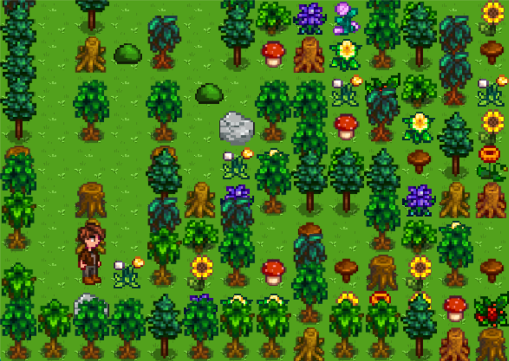
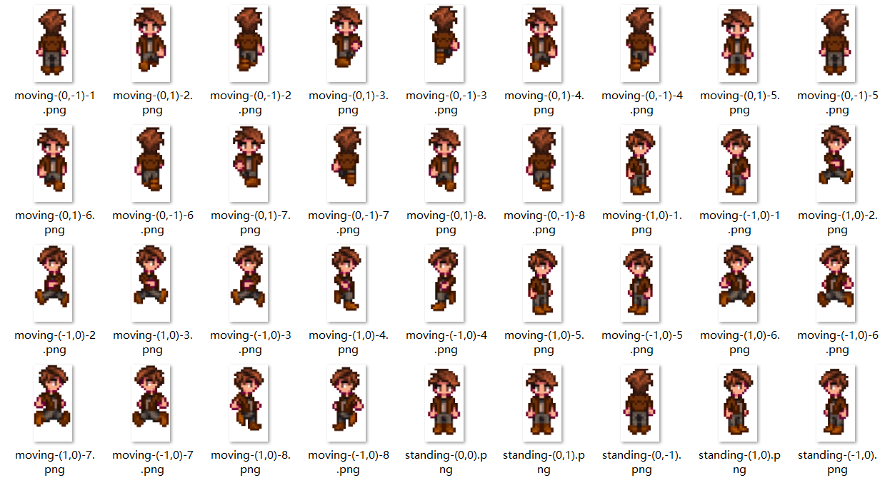

# report

## 1 引言

本项目为SI100B课程最终项目。 

我们制作的是一款休闲小游戏。在游戏中玩家需要扮演小镇中的一位镇民，最初身无分文，但是能够用丢炸弹的方式进行战斗。玩家需要穿越迷宫森林，找到森林深处的镇长女儿。

战斗采用即时制。我们采用了《泡泡堂》的基本玩法。玩家可以通过丢炸弹的方式进行攻击，玩家和怪物史莱姆在被炸弹炸中后均会扣血，血量为零时会死亡。

当炸弹炸中可摧毁物时有概率会掉落金币或特殊道具：增加生命、提高速度、增加炸弹数量、增加爆炸威力。玩家可以拾起以得到金币或相应能力。若掉落物被炸弹炸中，则会被摧毁。随着游戏进行，掉落道具的概率会降低，游戏难度会增大。

玩家拾起金币后可以返回小镇的商店中购买道具。当玩家和商店女老板好感度越高，商店内道具的价格会越低。玩家可以通过聊天或者购买道具的方式提升好感度。

游戏拥有双结局。当玩家深入森林，找到镇长女儿时可达成结局一。如果不想深入森林，与商店女老板的好感度达到100时，可达成结局二。

## 2 场景

游戏中一共有四个场景

### 2.1 小镇

小镇是玩家进入游戏时所在场景，拥有大量交互点，玩家可以通过按”F“交互，了解游戏背景。为了让玩家有更好的体验，地图中设置了空气墙限制玩家的移动。具体交互将在后文提及。

### 2.2 森林

当玩家走到小镇右侧时会自动传送至森林。森林的整体是一个巨大的迷宫，由不可摧毁物、可摧毁物、怪物、空地组成。其中不可摧毁物的位置是固定的，其他的都会在每次随机生成。

固定地图如下：

不可摧毁物格随机渲染素材如下：

可摧毁物随机渲染素材如下：

### 2.3 商店

当玩家按”F“与商店门进行交互，会被传送至商店内部。玩家可以在商店内部购买物品或者与商店女老板聊天。

### 2.4 森林深处

当玩家穿越森林便会传送到森林深处，在这里玩家将会遇见失踪的镇长女儿。

## 3 角色

### 3.1 主要角色

在我们的游戏中，玩家可以通过”wasd“或”上下左右“来操控角色进行移动，按空格键丢出炸弹，按”F“键与可交互物品进行交互，按”enter“键结束聊天输入/继续聊天，按”esc“键强制退出对话。在角色移动时，四个方向均会渲染对应方向的一组动画，因此达到流畅的效果。

当角色受到炸弹攻击或者碰到怪物时，会损失生命值，角色会持续一段时间闪烁，进入短暂的无敌状态。

### 3.2 怪物

森林中存在着随机刷新的史莱姆。史莱姆的移动同样具有流畅的动画，在朝前面走时可以看到其眼睛，而其他三个方向则不能。

史莱姆会在空地上随机游走，在合适的地方放炸弹，并通过算法防止自己受到炸弹攻击。具体代码的实现将在后文说明。

### 3.3 其他NPC

#### 3.3.1 商店女老板

位于商店中。在她面前交互会开始聊天，而于蓝色橱柜前交互则会开始购买物品，其中聊天功能由LLM实现，具体实现将在后文说明。

#### 3.3.2 九九

位于小镇左上角。在它面前交互会开始聊天。聊天功能由LLM实现，具体实现将在后文说明。

#### 3.3.3 冰淇淋店老板

位于小镇右侧。在他面前交互后他会告诉你左特的五十七条戒律。

#### 3.3.4 镇长女儿

位于森林深处。当玩家成功通过森林时会看到她，跟她交互则会达成结局一。

## 4 游戏玩法

### 4.1 核心玩法

游戏的核心玩法为扔炸弹。玩家点按空格键会在当前格掷下一个炸弹，炸弹会在若干秒后爆炸，形成十字形的爆炸范围，如果遇到可摧毁物或不可摧毁物，爆炸范围将不再延伸。若角色和怪物在爆炸范围内则会减少生命值，若可摧毁物在爆炸范围内则会被炸毁，并有一定概率掉落道具和金币，具体掉落由LLM生成，将在后文说明。玩家需要杀死怪物，穿越森林迷宫，到达森林深处，找到小镇女儿，方可通关，达成结局一。

炸毁可摧毁物时，有概率掉落以下可掉落物：

（从左至右依次为增加炸弹数量、增加生命、提高速度、增加爆炸范围、金币）

增加炸弹数量：玩家初始场上所能投掷炸弹数为1。这意味着由玩家投掷的炸弹在场上只能同时存在一个。每拾起一个该种道具，由玩家投掷的炸弹在场上可同时存在数量将会加1。

增加生命：玩家初始生命值为5。当玩家碰到怪物或被炸弹炸到时，生命值会减1。每拾起一个该种道具，玩家生命值会加1。

提高速度：玩家速度分为快和慢两个档次，初始为慢。在第一次拾起该种道具后，档次调整为快

增加爆炸范围：玩家初始炸弹爆炸范围为1，即以爆炸点为中心向四周扩散一格。每拾起一格该种道具，炸弹爆炸范围将会加1。

金币：可在商店购买道具。

### 4.2 资源系统

玩家可以通过炸毁可摧毁物的方式获得金币。持有金币后可以在商店购买以下道具：

Heal Potion：作用同增加生命道具

Sensitive Potion：作用同提高速度道具

Expanded Bomb Grid Potion：作用同增加爆炸范围道具

Kicking Bomb Boots：当持有此道具时，若角色面朝方向前方有炸弹并且再前方为空地，玩家可通过移动到炸弹所在格的方式将炸弹向前踢出，即炸弹向前移动，直至前方为障碍物时停止。这是能够改变同一炸弹位置的唯一道具。

### 4.3 好感度机制

玩家与商店女老板之间存在着好感度系统，好感度初始为10。玩家可以通过和商店女老板聊天（增加或减少）和买东西（每次加5）来提升好感度。好感度越高，商品的价格将会越低。当好感度达到100时，将会触发特殊剧情，达成结局二

## 5 LLM

### 5.1 语言ai

#### 5.1.1 商店女老板

功能实现位于`shopowner_ai.py`中。输入一段话后，ai会生成老板的回复（可视）和聊天后的好感度（不可视）。由于project提供的ai有些许愚蠢，很难保证回复一定是一段话和一个数字的循环往复。因此我们在询问好感度时使用了while循环，只有当ai提供了正确的数字时才可以跳出循环。

#### 5.1.2 九九

功能实现位于`nine_ai.py`中。输入一段话后，ai会生成九九的回复。但注意，九九是一只猫，所以它只会生成猫的回复（一般为`Meow~`）。

### 5.2 决策ai

功能实现位于`decision_ai.py`中。当输入当前场上被炸毁物品数量，ai会从1~5中随机输出一个数字，代表此次掉落物的种类。当被炸毁物品数量越多，输出5的概率就会越大，即掉落金币的概率越大。（不会用多线程，所以会因网络请求导致卡顿）

## 6 游戏性

### 6.1 开始界面

玩家在开始界面可以通过a/左箭头和d/右箭头来选择加载新游戏和退出游戏，按“enter"键即可确认。

### 6.2 结束界面

游戏中一共有三种结束界面：GameOver、结局一、结局二

在结束界面玩家通过按”enter“键即可重启游戏，返回开始界面。

### 6.3 bgm

开始界面和四个场景都配有不同的bgm，切换场景时bgm也会随之切换。

## 7 代码

### 7.1 前转

首先我们考虑的是做xy坐标还是xz坐标(一个方向为垂直方向)，并写了`/demo/test.py`和`/demo/test-xz.py`发现xz方案的跳跃的手感（大跳和小跳），爬墙，重力系统等还是比较麻烦的，考虑到之后还会扩展许多东西，遂放弃。不过读者可以跑一下体验，支持跳跃和爬墙跳。

然后经过商议打算做泡泡堂。

首先是人物行动的是否只能在整数格上的问题。我们发现`/demo/test.py`人物在走入障碍围成的胡同（狭窄通道）时由于胡同的宽度和人物碰撞箱大小过于接近，难以对准，这当然可以通过缩小碰撞箱解决（但这样人物可以在胡同内侧向移动，但倒也没什么大不了的），不过我们当时决定人物只能在格子中央（相当在棋盘的黑白格子上）

考虑到人物只能在格子里走动，最开始的方案是大小帧方案（一个相当愚蠢的方案）：每个若干帧处理逻辑（大帧），其余帧只做渲染（小帧），人物在每两个大帧间移动一格，小帧来保证人物的移动是连续的。但是等笔者写完`/demo/demo.py`时才意识到一个严重的问题：人物不跟手。

`--|---(press)---|------------|---`$\tiny\text{竖线表示大帧}$

按下键盘的过程是在两个大帧之间完成的（如上图），那应该在第二个竖线处完成移动呢还是第三个呢？都不合适，一个会让运动不匀速一个会带来巨大延迟，取平衡的话会兼有两个缺点。读者可以自行尝试这垃圾的手感。

大小帧是行不通的。

不过这个方案的其他部分在最终的代码中得到了沿用，如存地图方式根据这个方案改成了二维数组套字典的方式，没有事件队列的entity-map架构（瞎起的名字，勿在意）

### 7.2 核心代码架构与设计概述

#### 7.2.1 entity-map架构

场地上所有能动的物品都为实体(entity)，所有不能动的物品作为格子存储在地图的二维数组中。

实体和实体之间不会直接发信息，而是通过地图类（`Mapper`）发信息。（某种意义上地图相当于起了部分事件队列的功能）这样函数调用在`entity`和`Mapper` 间回转（有点像二分图欸），一定程度上减少出现无限递归的概率。

- 比如说，实体完成自身的初始化之后调用构造函数(`__init__`)里的`initInMap`参数，在对应的地图类上进行初始化（如存到二维数组套字典中等）

然后原则上每个实体只修改自己的数据，不修改别的实体的数据，最好也不随便改地图的数据（有一部分没遵守，毕竟py好像没有 const 关键字，写着写着就忘了），如果想修改其他实体的数据，则尽量通过地图类调用其他实体的成员函数修改。这样做的目的是避免数据的混乱，不过在这个项目中好像也没有感觉出便利。

在每一帧中，依次调用`keyboard` `clock` `draw`事件。

- keyboard : 为catchKeyboard函数，将键盘输入按照当前玩家的状态分配到 `me.keyboard` 或 `dialoger.keyboard` ，它们根据键盘输入的信息进行预移动，切换对话上下文等。

- clock : 为 `me.clock`和`thisMap.clock`(其中在`thisMap.clock`又会调用地图中所有实体的clock成员函数)，它们将游戏推动到下一游戏时刻：进行entity的移动，炸弹爆炸等的计时，计时到0之后的处理等：大部分逻辑的处理都在这个阶段进行。(`dialog`类不需要clock，因为它按回车更新)

- draw ： 为`thisMap.draw`和`dialogger.draw`。它们渲染。`thisMap.draw`按照`camera`（镜头移动偏移量）等按照顺序从二维数组表示的图格中从左到右从上到下渲染（以便处理图片堆叠顺序，参见 _代码细节-渲染图层_ ）；`dialogger.draw` 绘制对话框。

**为啥不用事件队列？**

首先，以碰撞检测为例，感觉 all in 事件队列（不 all in 的话后面会说）虽然可能更清晰一些，但具有一定复杂性：

1. 实体向某个位置请求移动，向场景发送“请求移动”事件。

2. 场景收到请求，向所有不可重叠的实体发出“有实体向xxx移动的事件”。

3. 如果有不可重叠的实体返回拒绝向请求移动的实体返回拒绝。

4. 由于场景接受实体返回事件是**不即时的**，而且listener恐怕不能一次收两条信息，那么要等到时钟前移（STEP事件），如果没有不可重叠的实体返回拒绝，场景向请求移动的实体返回允许。

历时两帧，请求移动的实体和场景两次“握手”，还是蛮复杂的。

如果采用即时的函数调用，则要简单一些，参见 _代码细节-实体的移动-预移动成功与否的判断_

第二，提供的模板阅读难度较高，超出我们的能力范围，有一位队员耗时多天研究模板，最后基本搞明白了但是我们的代码已经写了很多，在加上事件队列会相当难改。

第三，虽然事件队列提供了较好的通信手段，也不能完全避免出现无限互调的可能性，如果出现，由于对模板代码掌控能力有限恐怕很难调（不过其实写的时候注意点就很难出现）

不过事件队列确确实实提供了较好的通信手段，因此有很多优点，而我们在写代码之前并没有考虑到，在写的时候逐渐发现：

1. 有效降低各模块之间的耦合度，有效避免我们现在代码出现的场景类（Mapper）和实体类（entityLike,creature,bomb,monster,player）之间耦合度过高的问题。

2. 虽然场景类（Mapper）可以有效的在主逻辑中起到通信作用，但在游戏外围设施建设中无法很好的通信：
   
   - 比如如果要加一个游戏引导装置，给玩家游玩提示，举个可能的例子，要在玩家在城镇里放炸弹的时候提醒玩家不要在城镇里放炸弹因为不文明，如何实现呢？
     
     在存在强壮的事件队列时，游戏引导模块只需要检测 putBomb 事件即可。但在我们的这种架构下，只能遍历场景中所有的实体，看看有没有炸弹，这相当的不美观。

所以说有选择性的选择即时调用函数通讯和事件队列通信或许是一个好的选择：比如说碰撞检测采用实时调用，键盘输入事件、添加实体事件等非常方便使用事件队列的事件塞入事件队列。

- 或许也可以使用更厉害的数据结构代替事件队列进行通信（可以吗？不懂）

#### 7.2.2 二维数组套字典的存图方式

由于所有实体实际上只能在格子里，无须复杂的碰撞体系，在加上在那啥中，二维数组是存储网格图的最常见方式，以及最开始看到的一个pygame小游戏也是以网格存图，所以理所当然的采用了按格子存储的方法。

- `"type": "field"|"wall"|"obstacle"|"object"` 地块类型，分别为空地、不可摧毁障碍物、可摧毁障碍物、掉落物
- `"burning":0` 受炸弹影响（炸弹爆炸冲击波）的倒计时
- `"entity":set()` 逻辑上位于此地块的实体集合
- `"entity_locked":set()` 这个地块被这个集合里的实体锁住，在预移动时加锁，防止两个本来不能重叠的实体重叠（见 _代码细节-实体移动_ ），其实意义不大。
- `"content":0` 内容编号，主要用于对掉落物具体类型的确定。
- `"render":myImage(...)` 要渲染的图

此外有下面的临时/可选标签

- `"render!":myImage(...)|None` 炸弹冲击波图像，因为冲击波要叠在原有地块之上

- `"burnCenter":True|None` 是否为爆炸中心，因为要提升爆炸中心的图层防止超出格子的部分被别的格子覆盖

- `"teleportTo":(a,b,c)|None` 传送到第 a 张图 (b,c) 坐标

- `"interact"` 表示这个地方可以按f交互，内容为协程函数（参见 _代码细节-使用协程与npc交互_ ）

经过了字典的武装，我们的二维数组可以存下多样的信息

**为啥不用碰撞箱检测？**

没必要。用我们的方法存图也有很多优点：

- 怪物的 ai 好写：基于网格图可以用简单的算法如 bfs 完成 ai

- 理论性能更好：地图中没有大量的实体，碰撞检测本身是 $O(1)$ 而不是 $O(\text{实体个数}) $

- 让实体只能在整数格子上可以很好的简化问题，如不会出现 _前传_ 中的胡同问题、踢炸弹时炸弹没有在格子中央爆炸如何处理爆炸范围的问题等。

当时也考虑了 “all in entity” 的方案，即所有的物品，包括可以动的实体和不可以动的障碍物全部使用pygame的矩形交判断所有碰撞，但最后没采用，因为笔者认为这样更好写（个人观点）。

#### 7.2.3 代码的依赖关系

如图

以下内容大多会在 _代码细节_ 中详述，这里主要将依赖关系。

`constants.py`存放常数与 Flag ，如帧率、默认血量、炸弹引爆时间等。

`imageclass.py` myImage类：我们以pygame的blit函数为基础封装了在多个方便的绘制函数。dialog类：提供了对话框的封装，可以方便的使用对话框。

`entity.py` 以imageclass为依托，实现了诸多entity类的各种功能，同时后半部分更为具体，功能更多的类由于需要频繁访问地图，虚线指向 scene.py

- `entity.py` 的后半部分代码以虚线指向 scene.py 表示“隐形”的依赖。观察 entity.py 中后半部分的函数，有很多成员函数的参数名叫mapper，它表示地图，但由于python的动态类型，无须import即可使用 scene.py 的内容，只是无法添加类型标注，这是从 entityLike 派生出的诸多类和 Mapper类耦合度大导致的，关于修改方法，见 _类型检查_ 一节。

`scene.py` 场景的各种函数，同样依托与渲染库 imageclass (主要是 myImage)，同时依赖 `entity.py` （主要是前半部分的 entity 和 creature ）。实现了场景（地图）的各种操作。

`inter.py` 本意为联合（雾），负责给 `entity.py` 和 `scene.py` 兜底。玩家虽也继承于实体（entityLike基类），但在这个文件里实现，因为玩家作为最复杂的实体，需要各种麻烦的操作（如检查键盘、捡东西、切换地图等）同时为main.py提供一些函数（如catchKeyboard）。音乐的播放在此。

`xxx_ai.py` 提供封装好的 llm 接口，直接调用其提供的函数与 llm 交互（参见 _5-LLM_）

`makescene.py` 储存每一张地图的信息，并提供生成地图函数。

`main.py` 主进程，包含主菜单，游戏主循环等

### 7.3 代码细节

其实前面也讲了不少细节了,这里再介绍一点东西。

#### 7.3.1 实体的移动

前面说的采用格子存图，这导致实体的移动从逻辑上是离散的而非连续的，所以人物的移动需要做处理。

我们在 entityLike 基类（entity.py开头）中存储了 gx gy 和 rx ry 两套坐标体系。 g 是 grid 的缩写 r 是 render 或 real 的缩写，g坐标表示格点坐标，r坐标表示在画布上的坐标。`gxy2rxy` 和 `rxy2gxy` 提供这两种坐标的转换。

**预移动：**
在 `tryMove` 函数中，如果得到地图的肯定回复 （`allowF`） ，会修改 `self.moving` 值，表示在 `self.moving=c.CellSize//self.speed+1` 帧内完成移动。同时，这里 `allowF`(`Mapper.moveRequest`)同时在 `mp[x][y]["entity_lock"]` 注册，占据这个移动的目标格子，防止在当前实体尚未移动完成时其他不可与之碰撞的实体向该格子移动。

**移动：** 然后在`clock`中进行真正的移动，每一帧移动一点点。如果跑过了两个格子的分界线，执行地图提供的`moveUpdate`函数更新字典中的 `"entity_lock"`和`"entity"`。在最后（moving=1时）跑`self.gxy2rxy()`，纠正使实体移动到目标格子中央。

**预移动成功与否的判断：** 这一部分包括  `Mapper.moveRequest` (scene.py) 和 `entityLike.walkInto` 。 `Mapper.moveRequest` 检测移动的目标是否合法，以及目在字典中的`"type"`字段是否标记不可到达（详见代码）。然后地图调用所有位于目标格子中的实体的 `walkInto`函数，再让已经在那里实体考虑这个请求。在`entityLike.walkInto`中仅仅对 `allowOverlap` 成员变量进行检测，是因为这个游戏的碰撞系统比较简单，所有实体中只有炸弹的 `allowOverlap` 为 False，表示炸弹在存在期间类似障碍物，而玩家与怪物的碰撞扣血在 `entityLike.overlap/player.overlap` 处理（`player.overlap`在 inter.py）

#### 7.3.2 玩家动图的绘制

在`moving`成员变量$>0$ 是渲染玩家移动的图片，其他时候渲染玩家静止的图片，怪物只有移动的图片（因为是史莱姆）。传入 `fpscnt` 表示当前为游戏的第几帧，根据其 mod 8 的值决定渲染走路的哪一帧。

此外，在 `entityLike.tryMove` 中，将 `self.moving` 与`1`比较而不是与`0`比较是为了避免在连续移动时中间有一帧 `self.moving==0` 渲染了玩家站立的图像。

#### 7.3.3 镜头移动

Mapper类中有一个 me 指针指向玩家，成员函数 genCamera 根据玩家坐标和地图长宽生成偏移量 camera ，myImage 类的所有渲染均会处理此偏移量。

#### 7.3.4 myImage类的封装

由于不少物品高度不只一格子（树，人），但是他们“站”在下面这一格，于是封装 `myImage.draw` 根据所“站”位置的 r 坐标画； `myImage.drawG`根据所“站”位置的 g 坐标画。这样只需传入正确的坐标即可方便的绘图。提供方便的接口配合 `Mapper.draw` 实现图层的正确渲染。

#### 7.3.5 渲染图层

`Mapper.draw`实现主逻辑的渲染，对地图从上到下从左到右渲染，以保证同图层的物品能够按前后正确堆叠，实体在其所在格子被渲染时调用`draw`函数。

对于所有实体来讲，其成员函数`draw`都有`layer`参数，表示正在画第几个图层，当layer参数等于当前实体的图层时才调用 `myImage.draw` blit 到画布上。

空地图层为0；炸弹冲击波图层为1；掉落物、炸弹、炸弹爆心图层为2；障碍物、人物图层为3。

#### 7.3.6 使用协程与 npc 交互

考虑到对于不接入llm的npc需要循环说话，接入llm的npc则是每次根据用户的输入反应，正好那天讲了强有力的协程，正好用过来了，协程在 makescene.py 中实现，装到地图的`"interact"`字段中，在`dialog.keyboard`函数中按一下 enter 触发一下协程调用，协程接受玩家的输入，返回 npc 的输出。

关于`xxx_ai.py`中 LLM 的部分，参见 _5-LLM_ 。

#### 7.3.7 dialog 类的封装

keyboard 部分在 `player.readToInteract` 变量为 True 时被调用以检测键盘，在不使用llm时仅检查 enter（`c.KeyboardConDialog`）和esc（`c.KeyboardEscDialog`），前者播放下一条对话，后者退出对话；存在 llm 时同时检测用户字符输入将其存在作为输入缓冲区的 `inputs` 成员变量中，支持退格删除，在输入手感上经过一定的优化，此时按下 enter 时将 `inputs` 成员变量发给协程函数。

draw 部分负责绘制，先画对话框，然后画文字，支持输入将要超过对话框时自动换行。

#### 7.3.8 怪物的 ai

使用bfs：存在一个移动队列。每次移动队列空或根据移动队列移动受阻的时候，进行下一步移动的搜索，通过成员函数 `_aiFindDangerousGird` 找到所有在炸弹爆炸范围内的格子，bfs搜寻离当前格子最近的安全格子，并更新移动队列。

为了防止当前格子安全时怪物不动，添加了 `walk1step` 成员函数，内容为走向一步能走到的安全格子，让怪物喜欢动起来。`walk1step`具体的触发参见 `monster.walk` 。

如果移动队列为空 ai 还有一定概率选择扔炸弹，设置怪物视野，在距离玩家 Manhattan 距离 $\le 6$ （`c.MonsterBombDis`）时才扔。减少怪物炸死自己可能，同时防止过多障碍被怪物炸开。

效果：怪物能很有效的躲避炸弹，在没有玩家参与时几乎不会自己死亡，只是偶尔会被自己扔的炸弹封在死胡同里。一般来说，玩家正常游玩的话能够在怪物炸死自己前找到并杀死地图中所有的怪物，这已经是很好的效果了。

#### 7.3.9 炸弹的移动与爆炸

还记得实体的成员函数 `walkInto` 表示什么吗? 表示有实体向当前实体移动。 `bomb.walkInto` 在拒绝那个请求移动的实体的同时（因为`bomb.allowOverlap==False`），还要判断是否触发踢炸弹。炸弹被踢后一直向被踢的方向请求移动直到碰到障碍。

炸弹的 `count` 数到 0 时在 `delete` 函数里执行爆炸和实体的删除。爆炸时向四个方向走直到爆炸范围或障碍物，私有函数 `__set` 执行对爆炸扫到的格子的处理，减少了重复代码：在其中完成了对处于爆炸影响格子的设置、爆炸贴图（burning2,3.png 不包括中心和尖端）的设置、掉落物的生成。然后添加尖端(burning4-7.png)和爆心 (burning1.png)的贴图，由于爆炸的贴图只有一层，因此多个炸弹连续爆炸有时会出现后爆炸弹爆炸的尖端被顶掉的现象。

#### 7.3.10 音乐

没有像处理对话框一样封装成类，在 inter.py 末尾使用裸露的函数处理，不过这样就没发处理音乐的淡出了。

#### 7.3.11 传送

好像这个也是踩分点，有两种传送，一种是按F传送（用于开门），一种是直接传送。注意直接传送互传的时候传送点要错开。一种更好但没有实现的传送方法（因为要大范围修改坐标）：将传出格子设为地图外面紧贴着的格子，将传入的格子设为边缘的格子（原本的传出格子），这样更平滑，应该能给玩家先走出地图在传送的感觉。

### 7.4 类型检查

前面说到因为entity.py后半部分mapper参数的类型为Mapper，其实依赖与scene.py但是因为python的动态类型是这个依赖可以不import，这样借助动态类型实现了类似于互相import。（采用了`c.LostType`标注这些Mapper签名）

这样显然是类型不安全的，为了尝试是否可以让他们变的类型安全，笔者从 tag 0.0.1 拉出一个分支进行测试。

目前[type-test](https://github.com/segment-tree/bubbles-valley/tree/type-test)分支提供了一种修改方法，拆分了entity.py的前后部分，解决了entity后半部分（拆出为 entityfamily ）隐形依赖的问题，[这个commit](https://github.com/segment-tree/bubbles-valley/commit/4eda9e9dfa4754ea69dc9b4110a3f6a173fa3ddf)可以看到拆分所做的一些修改（主要是`Mapper.addEntityEx` 和 `creature.putBomb`），实际上地图部分和实体部分耦合度仍然较大，这也算是不使用事件队列只使用直接互调函数的缺点。

对master分支使用mypy（`--disable_error_code=override`）~~除了那个标准库queue不知道发生了什么（修好了）~~，顺利通过了类型检查。

然后对type-test分支使用mypy（`--disable_error_code=override --disallow-untyped-defs`）发现一堆类型签名没有加，加了半天，同时尽量减少`Any`的使用，最坑人的一点是笔者发现python循环变量的生命周期是整个函数，在`disallow-untyped-defs`时就没法改变不同循环循环变量的类型了，好坑人！最终 inter.py 以上（根据 _核心代码架构与设计概述-代码的依赖关系_ ）基本通过类型检查，但改起来真的好费劲！

使用mypyc编译出现了一堆奇怪的问题，遂放弃。

### 7.5 OOP 代码复杂度

关于耦合度仍然较大，这导致了依赖的复杂性，如果项目复杂度非常大的画或许会出现像下图中的演变。

即便是经过精巧的设计也恐怕无法避免类的继承和派生带来的复杂依赖问题。

除了上述问题，在开发中还出现了类成员函数参数个数的膨胀，如 `myImage.__init__` 的 zoom 和 mode 参数都是后加的，因为要处理更多的情况，可以预见随着项目的开发很多类的成员函数的参数都会不可避免的膨胀。

### 7.6 性能分析

通过pyinstrument，20fps时运行时间和空闲时间大概各占一半（空闲时间略小与一半）。发现性能瓶颈在`win.blit()`（预渲染），占据了非空闲时间的90%以上，这使笔者大为震惊，很慢的list套list套字典并没有消耗太多性能。所以几乎没有优化性能的空间。

## 8 创意

### 8.1 美术

#### 8.1.1 素材选取

在商议之后，游戏采取了《星露谷》游戏的画风，采用部分素材。为了将《星露谷》和《泡泡堂》融合，我们还加入了部分原创素材，以保证游戏的画风和谐。

原创素材示例如下：

#### 8.1.2 动画与特效

我们为主要角色和怪物都设计了独特的移动动画，朝四个方向移动动画都不相同，让游戏更加生动，优化玩家游戏体验。

在爆炸瞬间，我们添加了爆炸特效，我们的算法根据障碍物位置、爆炸范围实时渲染出不一样的爆炸瞬间。

在玩家受到伤害时，小人会开始闪烁，区别受击状态和正常状态。

### 8.2 交互

游戏中存在着大量交互点位，让玩家在战斗之外的游戏体验更加丰富。

具体交互点位如下图蓝框所示：

### 8.3 成长机制

在游戏中玩家可以通过炸毁可摧毁物拾起道具或者在商店中购买道具两种方式提升个人数值。个人数值种类如下（详情已在4.1 、4.2提及）：

生命值：初始为5。在受到炸弹攻击或者碰到怪物时减1。

速度：分为“快”与“慢”。初始为“慢”。

炸弹爆炸范围：炸弹爆炸后生成十字的最大范围，初始为1。

炸弹数量：初始为1。

踢炸弹功能：分为“是”与“否”，初始为“否”。

### 8.4 好感度机制

内容同4.3，不再展开赘述。

### 8.5 双结局

我们为不喜欢战斗、无法达成结局一的玩家提供了第二种选择。

游戏的主要剧情：小镇镇长的女儿失踪在森林中，等待着勇士的营救。而勇敢的你突破重重困难，终于在森林深处找到了美丽的她，和她过上了幸福的生活。

当玩家找到镇长的女儿时，会达成结局：The Brave Warrior

然而，如果你对寻找镇长女儿毫无兴趣，也可以尝试“攻略”商店的女老板。当与老板的好感度达到100时，她会邀请你一同经营她的商店，达成结局：The Charming Villager